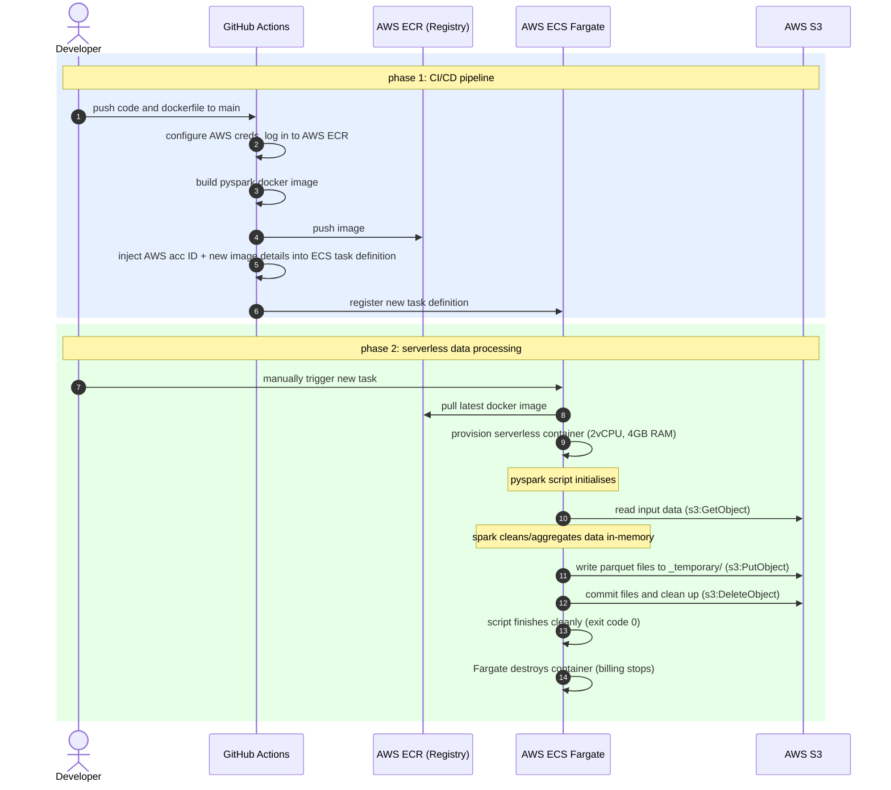

I figured it would be easiest to explain how I deploy and execute the code with a sequence diagram. A picture speaks a thousand words, I guess? :D

```mermaid
sequenceDiagram
    autonumber
    actor User as Developer
    participant GitHub as GitHub Actions
    participant ECR as AWS ECR (Registry)
    participant ECS as AWS ECS Fargate
    participant S3 as AWS S3

    %% CI/CD Pipeline Phase
    rect rgb(230, 240, 255)
    Note over User, S3: phase 1: CI/CD pipeline
    User->>GitHub: push code and dockerfile to main
    GitHub->>GitHub: configure AWS creds, log in to AWS ECR
    GitHub->>GitHub: build pyspark docker image
    GitHub->>ECR: push image
    GitHub->>GitHub: inject AWS acc ID + new image details into ECS task definition
    GitHub->>ECS: register new task definition
    end

    %% Execution Phase
    rect rgb(230, 255, 230)
    Note over User, S3: phase 2: serverless data processing
    User->>ECS: manually trigger new task
    ECS->>ECR: pull latest docker image
    ECS->>ECS: provision serverless container (2vCPU, 4GB RAM)
    Note over ECS: pyspark script initialises
    ECS->>S3: read input data (s3:GetObject)
    Note over ECS: spark cleans/aggregates data in-memory
    ECS->>S3: write parquet files to _temporary/ (s3:PutObject)
    ECS->>S3: commit files and clean up (s3:DeleteObject)
    ECS->>ECS: script finishes cleanly (exit code 0)
    ECS->>ECS: Fargate destroys container (billing stops)
    end
```
